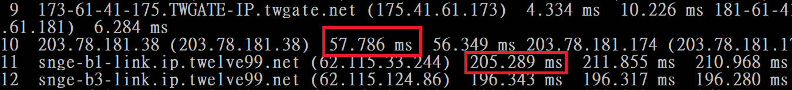

# Installation & Execution

Run `make` in the top-level directory to compile the `traceroute` executable.
The program supports a subset of options implemented by Linux `traceroute`[^1]:

`-f`
: Set the TTL of the first packet. (Default: 1)

`-m`
: Set the maximum TTL in the sent packets. (Default: 30)

`-w`
: The waiting time (in seconds) when receiving packets. (Default: 5)

`-q`
: The number of queries for a single hop. (Default: 3)


Note that, to mimic the behavior of Linux `traceroute`, the default protocol used is UDP instead of ICMP. This can be toggled with the following options:

`-I`
: ICMP mode

`-T`
: TCP mode

[^1]: Throughout, this refers to [Dmitry Butskoy's implementation](http://traceroute.sourceforge.net/).

# Implementation

In general, for each hop, the `traceroute` program sends several packets (depending on the option `-q`) with a fixed TTL set in the IP header. The packets either reach the destination or get discarded half-way through due to the insufficient TTL. The former case should be handled differently for each protocol, which we will cover in the following paragraphs. In the latter case, because the routers send ICMP replies when discarding packets, regardless of the transmission layer protocol, the same handling strategy can be shared among different modes.

Specifically, our program waits for two types of ICMP reply after sending requests in all protocols: destination unreachable (type 3) and time exceeded (type 7). When encountering the former reply, we simply print out `!h`, `!n` or `!p` depending on the corresponding ICMP code. The latter reply suggests that the sent packet does not have enough TTL to procede to the destination, and thus we increment the hop counter and continue tracing. Additionally, since the routers might accidently discard our packets without notifying us, the socket used for receiving reply is configured with a certain timeout (specified by the `-w` option). When `recvfrom()` times out, `*` will be printed.

For ICMP, we simply issue ICMP echo requests to the destination. When the destination is reached, the server will reply to us an ICMP echo reply. The reply is then verified by comparing the identifier and sequence number with the expected values.

For UDP, we incorporate the same strategy as Linux `traceroute`. In particular, our program sends a UDP datagram with a fixed TTL to a specific port, which starts from an unusual number of 33435 and increments after each probe. Because the port we target is rarely used, we can assume that the destination is reached upon receiving ICMP port-unreachable messages and terminate the program. Additionally, the reply can be easily verified by the destination port of the UDP datagram it wraps.

Finally, for TCP, we use `connect` directly -- again with a fixed TTL -- to connect to the destination on port 80. Non-blocking mode together with `select` are used to ensure the timeout is honored. We then assume a packet has reached the destination if the connection is accepted or an ICMP port-unreachable message is received. Similar to UDP, replies are verified by their destination ports.

# Questions

## Detecting and Defending against `traceroute`

A possible way of detecting `traceroute` is to have routers that the server operator control in front of the server itself. Packets with low TTL can then be logged and correlated (e.g., if the same source sends multiple such packets) to spot potential `traceroute` attempts.

As for defending against `traceroute`, it is difficult to see in what threat model this actually makes sense. One can already obtain a lot of information from the destination IP address (e.g., AS number[^2]). If one desires to obfuscate such details, it is likely that she also wishes to hide the destination IP by the use of CDNs or even Tor hidden services.

However, if one still wishes to hide the `traceroute` details, one method is to have routers that do not respond with ICMP time-exceed messages in front of the server.

[^2]: Which can lead to additional peering information.

## The Reason `traceroute` Cannot Show the Full Route

Some intermediate routers may choose not to reply with ICMP time-exceed messages. Alternatively, sometimes a router is busy and may not have the resources to send out such messages. In these cases, the path cannot be shown by the `traceroute` command.

## Why the Result May Not Always Be the Same

The route a packet takes may depend on the underlying algorithms used by the intermediate routers. For instance, to perform load-balancing, a router might forward packets to different destinations even if they are identical. This may result in inconsistent outputs from the `traceroute` program.

# Comparison

## Domestic and Foreign

All the following experiments are conducted in the CSIE building, using the WiFi access points csie{,-5G} and the `traceroute` program we implemented running in ICMP mode.

The major difference between tracerouting a domestic server and a foreign server is the length of the route and the overall response time. Quite obviously, tracerouting foreign servers generally take more hops and more time than domestic servers.

Furthermore, packets that are bounded for foreign servers are likely to pass through *gateways* that coordinate packets leaving Taiwan. For example, when tracerouting codeforces.com, the round-trip time increases from 50ms to 200ms after hopping over the routers at `203.78.181.38`, as can be seen in Figure \ref{twgate}. Using ipinfo.io, we can confirm that this IP address belongs to the autonomous system Taiwan Internet Gateway, a subsidiary of Chunghua Telecom that specializes in international peering.



The detailed results can be found in Section \ref{Experiment1}.

## TCP, UDP, and ICMP

An experiment was conducted to traceroute codeforces.com (`213.248.110.126`). The results can be found in Section \ref{Experiment2}.

From this and several other experiments, we find that some destinations silently drop UDP but not TCP and ICMP packets, making the results of the latter two more useful in these cases.

- - -

We also observed that TCP and UDP were more sensitive to the selection of destination ports. For example, if we send UDP datagrams to a more commonly used UDP port, say 53, the requests are more likely to be dropped. In TCP, choosing ports other than 80 can similarly mess up the results.

This phenomenon can be seen from an example performing a `traceroute` to google.com, which is shown in Section \ref{Experiment3}.


# Appendix

## Experiment 1 {#Experiment1}

- Domestic
    - CSIE website (140.112.30.26)
    ```
     1 10.5.7.253 (10.5.7.253)  6.936 ms  3.947 ms  8.016 ms
     2 www.inm.ntu.edu.tw (140.112.30.26)  1.173 ms  1.110 ms  1.119 ms
    ```
    - TSMC (202.126.64.15)
    ```
     1 LPC.mshome.net (172.18.91.161)  0.779 ms  0.244 ms  0.282 ms
     2 10.5.7.253 (10.5.7.253)  9.459 ms  89.653 ms  56.104 ms
     3 172.17.0.2 (172.17.0.2)  29.228 ms  3.880 ms  8.138 ms
     4 140.112.16.190 (140.112.16.190)  12.003 ms  15.971 ms  13.277 ms
     5 140.112.149.121 (140.112.149.121)  10.287 ms  32.065 ms  15.863 ms
     6 140.112.0.242 (140.112.0.242)  70.729 ms  5.701 ms  7.289 ms
     7 140.112.0.206 (140.112.0.206)  11.952 ms  21.154 ms  8.999 ms
     8 tpdt-3301.hinet.net (211.22.226.202)  14.342 ms  21.845 ms  9.155 ms
     9 TPDT-3012.hinet.net (220.128.4.150)  6.501 ms  44.936 ms  15.528 ms
    10 220-128-25-138.HINET-IP.hinet.net (220.128.25.138)  16.592 ms  28.574 ms  31.653 ms
    11 sczs-3312.hinet.net (220.128.2.57)  13.017 ms  20.755 ms  24.282 ms
    12 h145.s222.ts.hinet.net (168.95.222.145)  8.897 ms  26.827 ms  82.649 ms
    13 202-39-252-25.HINET-IP.hinet.net (202.39.252.25)  9.079 ms  86.673 ms  22.757 ms
    ```
- Foreign
    - codeforces.com (`87.240.191.209`)
    ```
     1 LPC.mshome.net (172.18.91.161)  1.236 ms  0.497 ms  0.381 ms
     2 10.5.7.253 (10.5.7.253)  28.652 ms  12.865 ms  36.669 ms
     3 172.17.0.2 (172.17.0.2)  8.931 ms  13.525 ms  1.961 ms
     4 140.112.16.190 (140.112.16.190)  17.624 ms  8.226 ms  11.834 ms
     5 140.112.149.121 (140.112.149.121)  8.882 ms  51.239 ms  13.968 ms
     6 140.112.0.222 (140.112.0.222)  131.883 ms  5.461 ms  3.388 ms
     7 140.112.0.206 (140.112.0.206)  7.022 ms  9.755 ms  13.383 ms
     8 203.160.226.233 (203.160.226.233)  32.465 ms  9.696 ms  31.464 ms
     9 173-61-41-175.TWGATE-IP.twgate.net (175.41.61.173)  15.454 ms  20.913 ms  12.009 ms
    10 203.78.181.38 (203.78.181.38)  60.726 ms  53.249 ms  50.882 ms
    11 snge-b1-link.ip.twelve99.net (62.115.33.244)  195.887 ms  264.716 ms  202.052 ms
    12 snge-b3-link.ip.twelve99.net (62.115.124.86)  228.950 ms  194.462 ms  197.459 ms
    13 mei-b5-link.ip.twelve99.net (62.115.124.123)  254.199 ms  273.785 ms  262.222 ms
    14 ffm-bb2-link.ip.twelve99.net (62.115.124.60)  270.268 ms  275.339 ms  292.786 ms
    15 s-bb2-link.ip.twelve99.net (62.115.138.104)  272.092 ms  292.729 ms  287.145 ms
    16 sap-b4-link.ip.twelve99.net (62.115.115.247)  289.984 ms  336.039 ms  278.236 ms
    17 m100-svc072762-ic360359.ip.twelve99-cust.net (62.115.145.97)  277.983 ms  279.961 ms  267.874 ms
    18 srv209-191-240-87.vk.com (87.240.191.209)  291.344 ms  294.120 ms  289.443 ms
    ```
    - poj.org (`168.235.95.213`)
    ```
     1 _gateway (10.5.7.253)  156.067 ms  87.602 ms  10.674 ms
     2 172.17.0.2 (172.17.0.2)  2.559 ms  1.984 ms  12.833 ms
     3 140.112.16.190 (140.112.16.190)  10.694 ms  11.297 ms  7.015 ms
     4 140.112.149.121 (140.112.149.121)  3.051 ms  3.769 ms  3.706 ms
     5 140.112.0.222 (140.112.0.222)  2.900 ms  4.139 ms  9.479 ms
     6 140.112.0.206 (140.112.0.206)  9.862 ms  18.061 ms  2.800 ms
     7 203.160.226.133 (203.160.226.133)  40.297 ms
       203.160.226.233 (203.160.226.233)  4.374 ms
       203.160.226.133 (203.160.226.133)  3.971 ms
     8 181-61-41-175.TWGATE-IP.twgate.net (175.41.61.181)  10.232 ms  3.271 ms  3.014 ms
     9 230-60-41-175.TWGATE-IP.twgate.net (175.41.60.230)  138.214 ms  173.492 ms  134.874 ms
    10 38.122.183.73 (38.122.183.73)  148.181 ms  165.018 ms  154.132 ms
    11 be2431.ccr41.sjc03.atlas.cogentco.com (154.54.88.189)  159.868 ms  178.960 ms  157.573 ms
    12 te0-3-0-4.128.br04.sjo01.pccwbtn.net (63.217.21.97)  157.422 ms  146.006 ms  141.384 ms
    13 TenGE0-2-0-0.br03.lax04.pccwbtn.net (63.218.50.177)  145.887 ms  146.587 ms  152.753 ms
    14  * * *
    15 168.235.95.213 (168.235.95.213)  139.287 ms  138.260 ms  154.153 ms
    ```

## Experiment 2 {#Experiment2}

* UDP
  ```
   1 _gateway (10.5.7.253)  5.177 ms  12.853 ms  7.370 ms
   2 172.17.0.2 (172.17.0.2)  1.063 ms  9.192 ms  8.347 ms
   3 140.112.16.190 (140.112.16.190)  14.703 ms  9.227 ms  4.747 ms
   4 140.112.149.121 (140.112.149.121)  8.071 ms  8.947 ms  2.213 ms
   5 140.112.0.222 (140.112.0.222)  4.105 ms  1.352 ms  15.247 ms
   6 140.112.0.206 (140.112.0.206)  10.483 ms  2.529 ms  2.092 ms
   7 203.160.226.133 (203.160.226.133)  17.977 ms  2.576 ms  9.485 ms
   8 181-61-41-175.TWGATE-IP.twgate.net (175.41.61.181)  8.921 ms
     173-61-41-175.TWGATE-IP.twgate.net (175.41.61.173)  2.519 ms  6.870 ms
   9 203.78.181.174 (203.78.181.174)  56.258 ms
     203.78.181.38 (203.78.181.38)  50.063 ms  51.124 ms
  10 snge-b1-link.ip.twelve99.net (62.115.33.244)  191.701 ms  286.606 ms  211.198 ms
  11 snge-b3-link.ip.twelve99.net (62.115.124.86)  192.443 ms  203.274 ms  212.645 ms
  12 mei-b5-link.ip.twelve99.net (62.115.124.123)  253.050 ms  249.095 ms
     mei-b4-link.ip.twelve99.net (62.115.143.22)  244.832 ms
  13 ffm-bb2-link.ip.twelve99.net (62.115.124.60)  268.867 ms
     ffm-bb1-link.ip.twelve99.net (62.115.116.20)  273.898 ms  273.515 ms
  14 s-bb2-link.ip.twelve99.net (62.115.138.104)  278.886 ms
     s-bb3-link.ip.twelve99.net (62.115.138.236)  274.170 ms *
  15 sap-b4-link.ip.twelve99.net (62.115.115.249)  291.637 ms  272.464 ms  275.262 ms
  16 m100-svc072762-ic360359.ip.twelve99-cust.net (62.115.145.97)  282.819 ms  292.106 ms  275.618 ms
  17 srv209-191-240-87.vk.com (87.240.191.209)  289.786 ms  279.066 ms
     srv247-191-240-87.vk.com (87.240.191.247)  276.316 ms
  18  * * *
  19  * * *
  20  * * *
  21  * * *
  22  * * *
  23  * * *
  24  * * *
  25  * * *
  26  * * *
  27  * * *
  28  * * *
  29  * * *
  30  * * *
  ```
* TCP
  ```
   1 _gateway (10.5.7.253)  4.778 ms  8.129 ms  9.314 ms
   2 172.17.0.2 (172.17.0.2)  1.375 ms  3.463 ms  7.266 ms
   3 140.112.16.190 (140.112.16.190)  8.777 ms  5.986 ms  4.053 ms
   4 140.112.149.121 (140.112.149.121)  2.971 ms  5.007 ms  2.182 ms
   5 140.112.0.222 (140.112.0.222)  2.505 ms  1.887 ms  3.493 ms
   6 140.112.0.206 (140.112.0.206)  3.597 ms  3.256 ms  2.335 ms
   7 203.160.226.133 (203.160.226.133)  3.368 ms
     203.160.226.233 (203.160.226.233)  7.892 ms  2.289 ms
   8 181-61-41-175.TWGATE-IP.twgate.net (175.41.61.181)  2.468 ms  3.031 ms
     173-61-41-175.TWGATE-IP.twgate.net (175.41.61.173)  2.524 ms
   9 203.78.181.38 (203.78.181.38)  57.954 ms  53.096 ms  60.469 ms
  10 snge-b1-link.ip.twelve99.net (62.115.33.244)  194.190 ms  194.756 ms  200.354 ms
  11 snge-b3-link.ip.twelve99.net (62.115.124.86)  191.790 ms  193.862 ms  203.713 ms
  12 mei-b4-link.ip.twelve99.net (62.115.143.22)  243.668 ms  243.337 ms
     mei-b5-link.ip.twelve99.net (62.115.124.123)  248.419 ms
  13 ffm-bb2-link.ip.twelve99.net (62.115.114.202)  265.831 ms
     ffm-bb1-link.ip.twelve99.net (62.115.116.20)  266.213 ms
     ffm-bb2-link.ip.twelve99.net (62.115.124.60)  269.276 ms
  14 s-bb3-link.ip.twelve99.net (62.115.138.236)  274.976 ms
     s-bb2-link.ip.twelve99.net (62.115.138.104)  270.357 ms
     s-bb3-link.ip.twelve99.net (62.115.138.236)  273.353 ms
  15 sap-b4-link.ip.twelve99.net (62.115.115.247)  279.866 ms  265.030 ms  273.439 ms
  16 m100-svc072762-ic360359.ip.twelve99-cust.net (62.115.145.97)  279.134 ms  272.046 ms  270.782 ms
  17 srv247-191-240-87.vk.com (87.240.191.247)  268.101 ms  287.006 ms
     srv209-191-240-87.vk.com (87.240.191.209)  307.428 ms
  18  * * *
  19 213-248-110-126.teliacarrier-cust.com (213.248.110.126)  272.691 ms  289.466 ms  274.597 ms
  ```
* ICMP
  ```
   1 _gateway (10.5.7.253)  13.040 ms  12.230 ms  6.248 ms
   2 172.17.0.2 (172.17.0.2)  3.782 ms  5.563 ms  10.574 ms
   3 140.112.16.190 (140.112.16.190)  11.496 ms  10.306 ms  8.886 ms
   4 140.112.149.121 (140.112.149.121)  7.881 ms  1.962 ms  6.497 ms
   5 140.112.0.222 (140.112.0.222)  2.087 ms  8.428 ms  1.921 ms
   6 140.112.0.206 (140.112.0.206)  2.962 ms  7.081 ms  2.648 ms
   7 203.160.226.133 (203.160.226.133)  7.442 ms  7.132 ms  13.198 ms
   8 173-61-41-175.TWGATE-IP.twgate.net (175.41.61.173)  10.789 ms  3.117 ms  2.813 ms
   9 203.78.181.38 (203.78.181.38)  62.771 ms  56.156 ms  54.199 ms
  10 snge-b1-link.ip.twelve99.net (62.115.33.244)  203.994 ms  208.414 ms  193.165 ms
  11 snge-b3-link.ip.twelve99.net (62.115.124.86)  194.337 ms  222.604 ms  195.796 ms
  12 mei-b5-link.ip.twelve99.net (62.115.124.123)  250.144 ms  253.142 ms  248.075 ms
  13 ffm-bb1-link.ip.twelve99.net (62.115.124.58)  279.157 ms  280.623 ms  283.093 ms
  14 s-bb3-link.ip.twelve99.net (62.115.138.236)  293.509 ms  291.686 ms  292.873 ms
  15 sap-b4-link.ip.twelve99.net (62.115.115.249)  283.721 ms  289.526 ms  283.743 ms
  16 m100-svc072762-ic360359.ip.twelve99-cust.net (62.115.145.97)  281.130 ms  284.971 ms  285.200 ms
  17 srv247-191-240-87.vk.com (87.240.191.247)  285.636 ms  304.410 ms  287.190 ms
  18  * * *
  19 213-248-110-126.teliacarrier-cust.com (213.248.110.126)  289.667 ms  291.852 ms  290.824 ms
  ```

## Experiment 3 {#Experiment3}

* Destination port fixed to 53:
  ```
   1 _gateway (192.168.40.1)  0.730 ms  0.617 ms  0.599 ms
   2 gateway243.m3.ntu.edu.tw (140.112.243.254)  1.312 ms  1.273 ms  1.239 ms
   3 140.112.0.98 (140.112.0.98)  1.074 ms  1.185 ms  1.174 ms
   4 140.112.0.250 (140.112.0.250)  1.009 ms  1.180 ms  1.256 ms
   5 140.112.0.206 (140.112.0.206)  3.106 ms  1.530 ms  1.628 ms
   6 140.112.0.34 (140.112.0.34)  1.919 ms  1.733 ms  1.428 ms
   7 72.14.196.229 (72.14.196.229)  1.909 ms  2.162 ms  2.238 ms
   8  * * *
   9  * * *
  10  * * *
  [snip]
  ```
* Destination port counting up from 33435:
  ```
   1 _gateway (192.168.40.1)  0.909 ms  0.745 ms  0.704 ms
   2 gateway243.m3.ntu.edu.tw (140.112.243.254)  1.519 ms  1.285 ms  1.361 ms
   3 140.112.0.98 (140.112.0.98)  1.380 ms  1.321 ms  1.173 ms
   4 140.112.0.230 (140.112.0.230)  1.300 ms
     140.112.0.250 (140.112.0.250)  1.088 ms  1.314 ms
   5 140.112.0.206 (140.112.0.206)  8.233 ms  2.036 ms  1.774 ms
   6 140.112.0.34 (140.112.0.34)  2.888 ms  1.670 ms  1.835 ms
   7 72.14.196.229 (72.14.196.229)  6.426 ms  2.087 ms  2.333 ms
   8 108.170.244.97 (108.170.244.97)  2.597 ms
     108.170.244.129 (108.170.244.129)  3.805 ms
     108.170.244.97 (108.170.244.97)  2.515 ms
   9 216.239.48.135 (216.239.48.135)  3.181 ms
     108.170.225.177 (108.170.225.177)  3.331 ms  3.346 ms
  10 tsa03s06-in-f14.1e100.net (172.217.160.110)  2.277 ms  2.290 ms  2.322 ms
  ```
